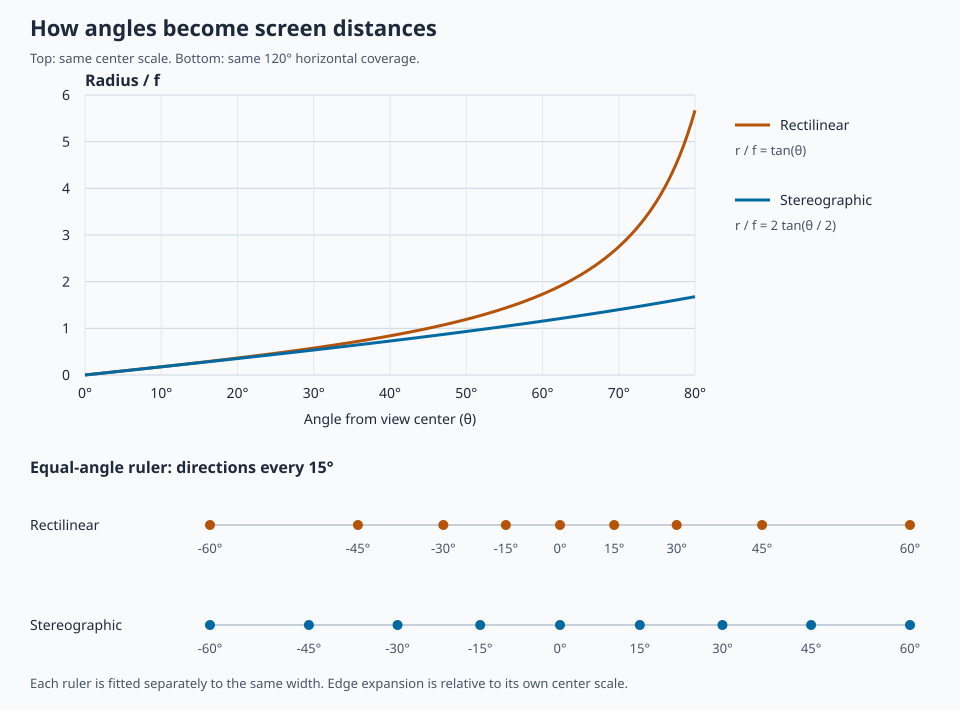
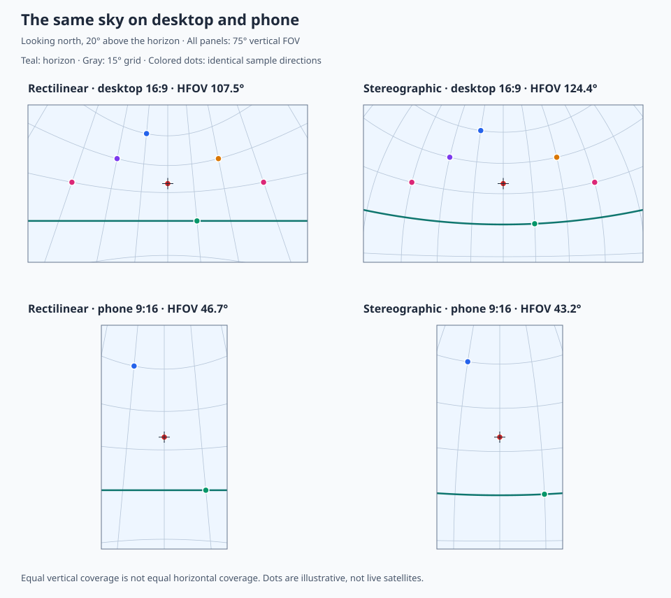

# Projecting the sky: rectilinear and stereographic

This tutorial explains why the satellite viewer stretches the edges of wide
screens, how stereographic projection changes that behavior, and how it is
implemented. The app now uses **stereographic projection**; rectilinear was its
original projection and is included here for comparison.

The implementation is in [`src/stereographic.ts`](../src/stereographic.ts) and
[`src/SkyLayers.ts`](../src/SkyLayers.ts). It retains the original variable-distance
positions and `RANGE_SCALE`: unit directions are calculated temporarily during
projection, and original ranges still control marker sizes.

## 1. A satellite is a direction before it is a pixel

The observer sits at the origin. The worker expresses satellite positions in
local **east, north, up** coordinates:

```text
east  = R × cos(elevation) × sin(azimuth)
north = R × cos(elevation) × cos(azimuth)
up    = R × sin(elevation)
```

Here `R` is the scaled distance to the satellite. Azimuth starts at north and
increases toward east. See [`src/worker.ts`](../src/worker.ts) and
[`src/consts.ts`](../src/consts.ts). The horizon and compass use the same geometry,
at a fixed radius, in [`src/earthReference.ts`](../src/earthReference.ts).

For placing a satellite's **center** on screen, its direction is what matters:
normalizing the position removes `R`. Distance can still affect marker size,
visibility, or depth ordering; it does not need to affect angular placement.

There are two separate operations:

1. **View transformation:** rotate the coordinates into the camera's frame.
   Bearing and pitch determine where we look.
2. **Projection:** map camera-relative directions onto a flat screen.

Changing projection need not change the satellite propagation, observer
location, or the direction reported by phone orientation sensors.

## 2. The two radial mappings

Let `θ` be the angle between a direction and the camera's forward axis, and `φ`
its angle around that axis. Both projections place that direction at:

```text
x = r(θ) × cos(φ)
y = r(θ) × sin(φ)
```

The difference is the radial mapping. Angles in the formulas are in **radians**.
`f` is a scale in pixels, not the satellite's physical distance.

| Projection | Radial mapping | Inverse mapping |
|---|---|---|
| Rectilinear | `r = f × tan(θ)` | `θ = atan(r / f)` |
| Stereographic | `r = 2f × tan(θ / 2)` | `θ = 2 × atan(r / (2f))` |

Near the center, both have `r ≈ f × θ`. With the same `f`, their center scale is
the same. Farther away, rectilinear grows much faster.



**Reading the diagram:** the curve plot uses the same center scale `f` for both
projections. The lower rulers instead fit the same −60° to +60° coverage into
the same width. Dots are directions 15° apart. Rectilinear pushes successive
directions increasingly far apart near the edges; stereographic does so much
less. These are two different comparisons, deliberately labeled.

### Rectilinear: projecting onto a tangent plane

Think of rays starting at the observer and intersecting a flat plane in front
of the camera. This is conventional perspective photography.

- Straight 3D lines project to straight screen lines.
- Great circles on the sky, including the ideal horizon, project to straight
  lines wherever they are visible.
- Peripheral angular spacing expands rapidly.
- `tan(θ)` diverges at 90°: a single rectilinear view cannot cover 180° or more
  across its center.

For a unit camera direction `(u, v, w)`, where `w` is **positive forward**:

```text
x = f × u / w
y = f × v / w
```

Visible directions must be on the forward side, with additional clipping at
the screen edges. Graphics APIs often use negative camera Z as forward; adapt
the signs when implementing these formulas.

### Stereographic: projecting from the opposite pole

Imagine a unit sphere centered on the observer. For every direction on it, draw
a line from the sphere's **rear pole** through that direction to the plane
tangent at the front pole. The intersection is the stereographic image.

For the same unit direction:

```text
x = 2f × u / (1 + w)
y = 2f × v / (1 + w)
```

This is equivalent to `r = 2f × tan(θ / 2)`.

- It preserves **local angles and infinitesimal shapes** (it is conformal).
- It does not preserve area, distances, or a uniform pixels-per-degree scale.
- Circles on the sphere become circles or straight lines on the plane.
- A horizon through the screen center is straight; otherwise it is curved.
- The singularity is at the rear pole, `θ = 180°`, rather than at 90°.
  Practical views still need explicit angular limits and clipping.

Conformal does not mean large constellations retain their exact shape, nor that
markers automatically stay readable. Markers and text should be drawn in
screen space after projecting their anchors.

## 3. Quantifying distortion

The rate at which radial position changes with angle is:

```text
rectilinear:    dr/dθ = f × sec²(θ)
stereographic: dr/dθ = f × sec²(θ / 2)
```

For a small spherical patch, the tangential scale is `r / sin(θ)`:

```text
rectilinear:    tangential scale = f × sec(θ)
stereographic: tangential scale = f × sec²(θ / 2)
```

Stereographic's radial and tangential scales agree, explaining its local shape
preservation. Rectilinear stretches radially more than tangentially.

At a **120° horizontal FOV**, each side edge on the horizontal centerline is
60° from the viewing axis:

| Projection | Radial edge scale / center scale | Tangential edge scale / center scale |
|---|---:|---:|
| Rectilinear | 4.00× | 2.00× |
| Stereographic | 1.33× | 1.33× |

These ratios describe geometry, not necessarily the visual size of the app's
satellite dots. Its point shader and hand-tuned sizing have their own behavior.
Corners are farther from the axis than side midpoints and have more distortion.

## 4. Field of view, desktop, and mobile

The app supplies `fovy = 75` to its `StereographicView` (which retains Deck.gl's
first-person camera/controller), both initially and when rebuilding the view after wheel zoom in
[`src/SkyView.tsx`](../src/SkyView.tsx). This means **75° vertical coverage**,
not 75° horizontal coverage.

For screen height `H` and vertical FOV `V`, choose the pixel scale as:

```text
rectilinear:    f = H / (2 × tan(V / 2))
stereographic: f = H / (4 × tan(V / 4))
```

With aspect ratio `A = width / height`, horizontal FOV is then:

```text
rectilinear:    HFOV = 2 × atan(A × tan(V / 2))
stereographic: HFOV = 4 × atan(A × tan(V / 4))
```

The stereographic formula can yield horizontal coverage beyond 180° at extreme
aspect ratios. The app caps the angle from center to a screen corner at 100°
by increasing the focal length on extreme aspect ratios, and clips geometry
beyond 120°. The table below describes the uncapped formulas.

At `V = 75°`:

| Screen | Rectilinear HFOV | Stereographic HFOV |
|---|---:|---:|
| Portrait phone, 9:16 | 46.7° | 43.2° |
| Desktop, 16:9 | 107.5° | 124.4° |
| Ultrawide, 21:9 | 121.6° | 153.5° |
| Super-ultrawide, 32:9 | 139.7° | 201.4° |

**Equal vertical FOV does not mean equal horizontal FOV or equal center scale.**
At 75° vertical coverage, stereographic makes the center scale about 13% larger
than rectilinear, while compressing the outer region relative to it. If a
comparison instead matches horizontal FOV, vertical coverage will differ.



**Reading the diagram:** all four panels look north at elevation 20°, with 75°
vertical coverage. Curves are azimuth/elevation grid lines, not screenshots or
orbit predictions. The bright horizon is at elevation 0°. Colored points are
the same sample directions in each projection. The desktop shows 16:9 and the
phone shows 9:16. Notice the differences in edge spacing and horizon curvature.

### Why mobile remains a good fit

Both mappings are rotationally symmetric about the viewing direction. Portrait
orientation introduces no special problem for stereographic. In portrait mode,
the long vertical dimension produces more peripheral distortion at the top and
bottom than at the left and right. Mobile landscape has the same wide-view
tradeoff as desktop.

For freely pointing a phone around the sky, stereographic has no projection
singularity when the **view center** points at the zenith. However, the app's
existing look-at camera uses a fixed up vector and limits pitch to ±89°;
changing projection would not remove that separate camera-rotation limitation.

At small FOVs both mappings converge, so highly zoomed views look similar.
Neither projection automatically calibrates alignment with the real sky seen
around the phone: that also depends on sensor accuracy and physical viewing
geometry. Rectilinear can match a flat window's ray geometry when calibrated;
stereographic deliberately remaps those off-axis rays.

## 5. How this fits the app's rendering pipeline

The data preparation already provides suitable observer-relative coordinates.
The substantial work is applying one consistent nonlinear projection across
the rendered layers.

```text
satellite propagation / reference geometry
                   ↓
             east, north, up
                   ↓
         camera bearing and pitch
                   ↓
   rectilinear OR stereographic projection
                   ↓
   screen-space dots, text, and line widths
                   ↓
         visible pass + picking pass
```

### A projection matrix is not sufficient

To see the limitation, first consider what a graphics projection matrix actually
does. The GPU takes a position `(X, Y, Z)`, adds a fourth coordinate equal to 1,
and multiplies by a 4×4 matrix:

```text
[clipX, clipY, clipZ, clipW] = M × [X, Y, Z, 1]

screenX ∝ clipX / clipW
screenY ∝ clipY / clipW
```

The fourth coordinate, `clipW`, is the denominator for the GPU's **perspective
divide**. Each matrix output can only be a weighted sum of the inputs:

```text
clipW = aX + bY + cZ + d
```

A matrix plus the divide can therefore perform more than a simple linear map,
but its numerator and denominator must each be linear expressions. It cannot
compute a square root, vector length, sine, or an arbitrary per-position scale.

For rectilinear projection, this is enough. Ignoring screen framing and depth
for a moment, choose matrix rows that produce:

```text
clipX = fX
clipY = fY
clipW = Z

after dividing: x = fX / Z, y = fY / Z
```

Here and below, camera-relative **positive Z points forward**. WebGL's usual
camera convention points forward along negative Z, so an implementation needs
an explicit sign conversion.

For stereographic projection of the app's arbitrary-distance positions, the
required outputs are instead:

```text
R = sqrt(X² + Y² + Z²)
x = 2fX / (R + Z)
y = 2fY / (R + Z)
```

That denominator contains `R`, the position's length. No choice of the constants
`a`, `b`, `c`, and `d` makes `aX + bY + cZ + d` equal to
`sqrt(X² + Y² + Z²) + Z` for arbitrary input positions. This is why simply
supplying a different `projectionMatrix` to Deck.gl is insufficient.

For example, take two points on the same ray:

```text
P = (1, 0, 1)       R = sqrt(2)
Q = (10, 0, 10)     R = 10 × sqrt(2)

correct stereographic x for both = 2f / (sqrt(2) + 1)
```

Using a constant denominator term, such as `Z + 1`, would place those points at
different screen positions even though the observer sees exactly the same
direction. The varying distance must cancel out.

#### Important exception: already-normalized directions

If the inputs are **already on the unit sphere**, their length is always 1.
Then `x = 2fu / (1 + w)` and `y = 2fv / (1 + w)` *can* be produced by matrix
rows with `clipX = 2fu`, `clipY = 2fv`, and `clipW = w + 1`. Points on another
fixed-radius sphere have a similar construction with that radius as the constant.

So the precise limitation is not “stereographic can never use a matrix.” It is:
**one conventional matrix cannot both turn arbitrary 3D positions into unit
directions and stereographically project them.** Normalization,
`direction = position / length(position)`, must happen somewhere else.

The app's ground references already have a fixed radius, but satellites and
their orbit points have varying distances. Normalizing them in a vertex shader
is a natural fit: positions can keep their existing shared-memory layout and
their original range can remain available for marker sizing and depth.

### What the shader implementation would look like

The GPU can perform the missing operations directly. Keep the matrix used for
camera rotation, then compute the stereographic mapping in shader code before
adding marker, label, or line-width offsets.

The following GLSL is an **implementation sketch**, not a drop-in Deck.gl
extension. It makes the coordinate conventions, framing, visibility, and depth
choices explicit:

```glsl
// Uniforms supplied when orientation, zoom, or viewport size changes.
uniform mat3 cameraFromENU; // Rotation: east/north/up -> camera coordinates.
                           // In this sketch, camera Z is POSITIVE forward.
uniform vec2 viewportPx;   // Width and height, in the same units as pixel offsets.
uniform float fPx;         // H / (4 * tan(verticalFovRadians / 4)).
uniform float nearRange;
uniform float farRange;
uniform float minForward;  // cos(maximum supported angle from view center).

// The caller must exclude HIDDEN sentinel positions before calling this.
bool stereographicClip(vec3 observerPosition, out vec4 clip) {
  vec3 p = cameraFromENU * observerPosition;
  float range = length(p);
  if (range <= nearRange || range >= farRange) return false;

  vec3 d = p / range;
  if (d.z < minForward) return false;

  float denominator = 1.0 + d.z;
  if (denominator <= 0.000001) return false; // Rear-pole singularity.

  // Pixel coordinates relative to screen center; positive Y points upward.
  vec2 pixel = 2.0 * fPx * d.xy / denominator;
  vec2 ndc = 2.0 * pixel / viewportPx;

  // Illustrative depth choice: linear observer range in WebGL's [-1, +1].
  // This is a deliberate new convention, not perspective depth preservation.
  float depth = 2.0 * (range - nearRange) / (farRange - nearRange) - 1.0;
  clip = vec4(ndc, depth, 1.0);
  return true;
}
```

**What happens to `clipW`?** This version has already performed the nonlinear
division, so it writes `clipW = 1`. The GPU's subsequent divide changes nothing.
It still clips against the screen rectangle and depth bounds. An implementation
could use other homogeneous representations, but every layer must agree on the
chosen convention.

The app's actual shader uses that other representation: `clipW = range - cameraZ`
with WebGL's **negative-forward** camera Z, and scales clip X/Y/Z accordingly.
Dividing by W gives the same stereographic screen position. Retaining the
denominator lets existing billboard paths interpolate and extrude in homogeneous
coordinates. Pixel offsets are multiplied by W to keep their screen sizes stable.

For a billboard marker or text glyph, project its center first, then add each
vertex's screen-space offset:

```glsl
vec4 centerClip;
if (!stereographicClip(anchorENU, centerClip)) {
  // Reject the entire primitive using the layer's visibility mechanism.
} else {
  gl_Position = centerClip;
  gl_Position.xy += 2.0 * offsetPx / viewportPx; // clipW is 1 here.
}
```

The offset calculation is separate from the sky mapping. It can keep a text
glyph at a fixed pixel size or deliberately scale a satellite marker using its
original range. Convert CSS pixels and device pixels consistently. Existing
perspective-`w` corrections and point-size behavior must be revisited because
`w` no longer has the perspective camera-depth meaning.

In `SkySatelliteLayer`, the explicit marker radius in CSS pixels is:

```text
sizeScale = POINT_SIZE × (4 - verticalFov / 25)
radiusPixels = clamp(sizeScale / scaledRange, 1.25, 6)
```

This retains the previous zoom multiplier and near/far size distinction while
removing off-axis marker enlargement. The 25-pixel picking tolerance is unchanged.
Markers remain visible without normalizing the stored positions onto a fixed
radius sphere. Compass text also stays at a fixed pixel size.

For a line, project **both endpoints** first, compute the perpendicular to that
line in pixel coordinates, and then extrude by its requested pixel width. Sample
curved paths sufficiently finely. If a line or triangle crosses the supported
angular boundary, clipping/splitting is required: rejecting individual vertices
does not correctly clip a connected primitive.

#### Concrete integration steps for this app

1. **Create a shared projection helper and uniforms.** A shader module should
   supply the rotation, viewport size, FOV-derived `fPx`, angular limit, and depth
   convention. Reuse its math in all participating layers.
2. **Wire it into layer shaders at their anchor/endpoint projection stage.**
   Use custom layer subclasses or appropriate shader injection points for
   points, text, paths, and ground. Update `OrbitLayer`'s custom vertex shader
   directly. A single final `DECKGL_FILTER_GL_POSITION` warp cannot supply all
   the required endpoint, extrusion, and clipping changes.
3. **Keep camera state and the controller.** Bearing, pitch, sensor updates,
   and drag rotation can continue driving the view. Derive the shader's rotation
   from that same state and update framing on resize and zoom. Do not apply the
   stock perspective projection before the new helper or let it clip the desired
   geometry first.
4. **Implement visibility and screen-space sizing consistently.** Handle the
   worker's hidden positions explicitly, adapt angular-boundary clipping, and
   replace assumptions about perspective `w` throughout the layer shaders.
5. **Use the identical shader mapping for GPU picking.** Provide matching CPU
   projection/unprojection where Deck.gl integrations need it. Verify that no
   matrix-based culling or screen-coordinate calculation rejects or misplaces
   geometry that the nonlinear shader would render.

For CPU unprojection, start with pixel coordinates relative to screen center,
with Y positive upward. The corresponding camera direction has a simple inverse:

```text
q = (pixelX, pixelY) / (2f)
s = q.x² + q.y²
direction = (2q.x, 2q.y, 1 - s) / (1 + s)
```

Rotate that direction back into east/north/up coordinates. This recovers a
**ray**, not a unique satellite distance. To recover a position, supply range
or intersect the ray with a chosen surface. For a CPU forward mapping, use the
same camera rotation and stereographic formula as the GPU.

### Project geometry before adding screen-space widths

| Current component | What a stereographic implementation must address |
|---|---|
| `PointCloudLayer` in `SkyView.tsx` | Project satellite centers; retain intentional distance-dependent sizing or explicitly redesign it. Keep markers circular and tap targets usable. |
| Ground `PolygonLayer` | Project the tessellated sphere consistently; check triangle curvature approximation and clipping. |
| Horizon and compass `PathLayer`s | Project endpoints and neighboring vertices before line extrusion; check widths, joins, and angular boundary crossings. |
| Compass `TextLayer` and `CompassLabelExtension` | Project label anchors first, then apply pixel offsets. Revisit the existing perspective-`w` size correction. |
| Custom `OrbitLayer` | Replace endpoint projection and its perspective near-plane clipping; compute pixel-width extrusion from the new projected endpoints. |

The horizon already has 256 segments, and ground bands use angular subdivisions.
That is helpful: nonlinear projection maps some straight segments to curves,
which a GPU approximates with small straight segments. Inspect whether existing
subdivision is sufficient at wide angles and high zoom, including orbit paths
sampled in time rather than at uniform angular intervals.

A final shader warp of an already extruded line or text quad is insufficient:
it can warp screen-space decorations and leaves perspective clipping assumptions
in place. The projection needs to occur at the appropriate stage for each layer.

### Picking, clipping, and zoom

- **Picking:** Deck.gl's GPU picking pass should use the same projected
  geometry as the visible pass. Check mouse hover and the explicit touch
  `deck.pickObject()` fallback, especially near the edges. Matrix-based CPU
  projection/unprojection cannot be assumed correct for nonlinear projection.
- **Clipping:** choose an angular domain and a depth convention. Preserve
  exclusions for below-horizon satellites; the current worker writes a `HIDDEN`
  position sentinel, and its existing clipping behavior must be reassessed.
  Split or clip lines crossing the domain boundary to avoid giant strips.
- **Zoom:** keep a meaningful angular FOV parameter and derive `f` using the
  selected projection's formula. Revisit the current hand-tuned `pointSize`
  multiplier instead of assuming it transfers unchanged.
- **Depth:** angular placement removes range, but depth testing and marker
  sizing can still use it. Define these independently; nonlinear projection
  does not supply a perspective depth convention automatically.
- **Performance:** GPU arithmetic is a plausible fit for the existing binary
  position updates. Measure on phones, including ground rendering and picking;
  mathematical suitability alone does not establish frame rate.

## 6. Choosing a projection

**Rectilinear** is useful when straight horizon/line geometry and conventional
perspective are priorities. An aspect-ratio-aware horizontal FOV cap is a small
way to reduce its wide-screen stretching, at the cost of seeing less sky.

**Stereographic** is a strong candidate when broad sky coverage, gentler
peripheral stretching, and consistent free rotation matter most. It works for
portrait phones as well as desktop, but trades straight off-center horizons for
curves and requires a moderate rendering change.

For a prototype, compare equal vertical FOV and equal horizontal FOV separately.
Check landscape, portrait, ultrawide, narrow zoom, near-zenith pointing, horizon
alignment, orbit continuity, edge tapping, label readability, and phone frame
rate. Do not mistake a wider visible footprint for reduced distortion at the
same coverage.

## Reproducing the visualizations

The SVGs are generated directly from the formulas above, without new dependencies:

```sh
node scripts/generate-projection-diagrams.mjs
```

The generator is [`scripts/generate-projection-diagrams.mjs`](../scripts/generate-projection-diagrams.mjs).
The sky diagrams use ideal spherical geometry and illustrative directions;
they do not depend on live satellite data.
